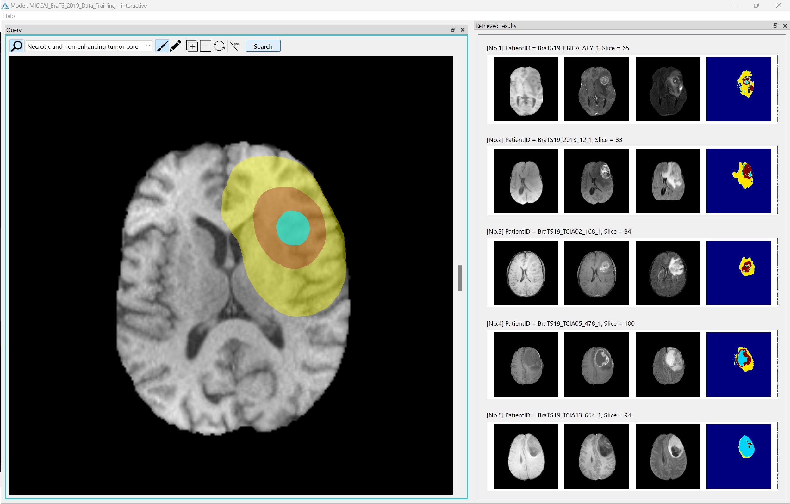

# Sketch-Based Medical Image Retrieval

This repository contains the official implementation of the sketch-based medical image retrieval (SBMIR) system described in the paper **"Sketch-based semantic retrieval of medical images"** by Kazuma Kobayashi et al. in _Medical Image Analysis_ (2024).

The paper is available at: [Sketch-based semantic retrieval of medical images - ScienceDirect](https://www.sciencedirect.com/science/article/pii/S1361841523003201)

## Application Screenshot

Below is a screenshot of the SBMIR application in action:



The screenshot showcases the user interface of the SBMIR application, demonstrating how users can interact with the system to perform sketch-based medical image retrieval.

## Overview

The SBMIR system enables users to retrieve medical images based on sketches of abnormalities and template images representing normal anatomy. The key components of the system are:

- Feature extraction module: Decomposes medical images into normal anatomy codes (ACs) and abnormal ACs using a deep learning framework.
- Similarity calculation module: Retrieves reference images based on the similarity between query vectors (constructed from user sketches and template images) and reference vectors (extracted from reference images).

## Repository Structure

- `App/`: Contains the implementation of the SBMIR system. By setting up the same environment, you can experience how the SBMIR system operates in practice.
- `ModelTraining/`: Contains the learning algorithm for the feature extraction module of the SBMIR system.

## Glioma Dataset

This repository uses the BraTS Dataset from the Multimodal Brain Tumor Segmentation Challenge 2019. The dataset can be downloaded from the [BraTS 2019 website](https://www.med.upenn.edu/cbica/brats2019/data.html). It consists of the following three datasets:

- MICCAI_BraTS_2019_Data_Training
- MICCAI_BraTS_2019_Data_Validation
- MICCAI_BraTS_2019_Data_Testing

After downloading and extracting the datasets, place them in the `SharedResources/datasets` directory. The directory structure should look like this:

```
.
├── App/
├── ModelTraining/
└── SharedResources/
   └── datasets/
       ├── MICCAI_BraTS_2019_Data_Training/
       │   ├── BraTS19_2013_0_1/
       │   │   ├── BraTS19_2013_0_1_flair.nii.gz
       │   │   ├── BraTS19_2013_0_1_t1.nii.gz
       │   │   ├── BraTS19_2013_0_1_t1ce.nii.gz
       │   │   ├── BraTS19_2013_0_1_t2.nii.gz
       │   │   └── BraTS19_2013_0_1_seg.nii.gz
       │   ├── BraTS19_2013_1_1/
       │   │   └── ...
       │   └── ...
       ├── MICCAI_BraTS_2019_Data_Validation/
       │   └── ...
       └── MICCAI_BraTS_2019_Data_Testing/
           └── ...
```

## Preprocessing

To preprocess the BraTS Dataset, use the `preprocess.py` script along with the `preprocess_config.json` configuration file.

To run the preprocessing script, execute the following command: `python preprocess.py --config preprocess_config.json`

This command will preprocess the datasets specified in the `src_dir_path` of `preprocess_config.json` according to the configuration settings. The preprocessed data will be saved as `.npy` files in the output directory specified by `dst_dir_path`.

## Trained Models

The trained models, namely `bottom2x2_margin-10-epoch=0299.ckpt`, used in this repository can be downloaded from Zenodo:

[](https://doi.org/10.5281/zenodo.10925122)

After downloading the pre-trained models, place them in the `SharedResources/saved_models/MICCAI_BraTS/` directory.

## Generating Embedding Representations

After preprocessing the MICCAI BraTS Dataset, navigate to the `ModelTraining/` directory and use the downloaded trained model to compute the embedding representations for each slice of the preprocessed dataset. This corresponds to the calculation of reference vectors for the reference dataset in the paper.

To generate the embedding representations, run the following command: `python run_training.py --config bottom2x2_margin-10_config.json --mode test`

This command will create patient-specific folders inside `SharedResources/latent_codes/MICCAI_BraTS_2019_Data_Training/bottom2x2_margin-10-epoch=0299/`, and within each folder, the slice-level embedding representations will be saved as numpy files.

## Running the SBMIR Application

To run the SBMIR application located in the `App/` directory, follow these steps:

1. Install MongoDB on your system. You can find the installation instructions for your operating system on the official MongoDB website: [MongoDB Installation Guide](https://docs.mongodb.com/manual/installation/).

2. Navigate to the `App/widget/contour_module/c_geometry` directory and compile the Cython code by running the following command: `python cythonize.py build_ext --inplace`

3. Finally, navigate to the `App/` directory and run the SBMIR application using the following command: `python main.py`

This will start the SBMIR application, and you can interact with it through the provided user interface.

## Citation

If you use this code or the SBMIR system in your research, please cite the following paper:

```
@article{KOBAYASHI2024103060,
    title = {Sketch-based semantic retrieval of medical images},
    author = {Kazuma Kobayashi and Lin Gu and Ryuichiro Hataya and Takaaki Mizuno and Mototaka Miyake and Hirokazu Watanabe and Masamichi Takahashi and Yasuyuki Takamizawa and Yukihiro Yoshida and Satoshi Nakamura and Nobuji Kouno and Amina Bolatkan and Yusuke Kurose and Tatsuya Harada and Ryuji Hamamoto},
    year = 2024,
    journal = {Medical Image Analysis},
    volume = 92,
    pages = 103060,
    doi = {https://doi.org/10.1016/j.media.2023.103060},
    issn = {1361-8415},
    url = {https://www.sciencedirect.com/science/article/pii/S1361841523003201},
    keywords = {Sketch-based image retrieval, Content-based image retrieval, Feature decomposition, Query by sketch, Query by example},
}
```

## License

This project is licensed under the terms of the CC-BY-NC-4.0 license.
